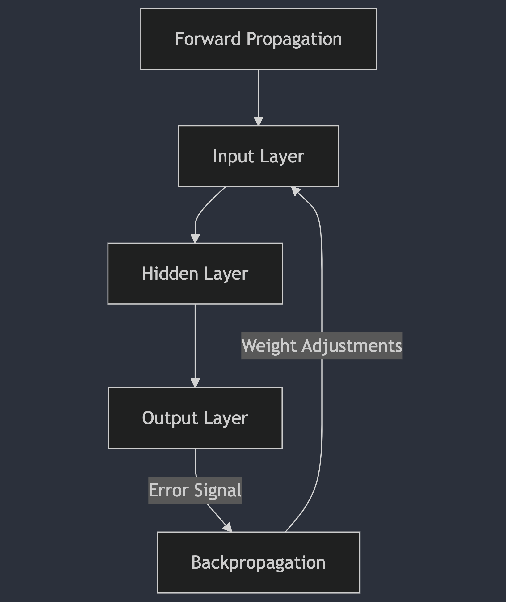

# Neural Networks

A **neural network** is a computational model inspired by the functioning of the human brain. It is used in machine learning and deep learning to solve complex problems such as classification, regression, and pattern recognition. Neural networks consist of layers of nodes or "neurons", each connected to neurons in the next layer. Each connection has a weight that adjusts the importance of the values propagated through the network.

## Key Parts of a Neural Network

1. **Input Layer**: This is the first layer of the network and receives the initial data used for training or prediction. Each neuron in this layer represents a feature or variable of the dataset. For example, in image datasets, the neurons in the input layer can represent the pixels of an image.

2. **Hidden Layer**: These are the intermediate layers that do not directly interact with the external world. A neural network can have one or more hidden layers. These layers are responsible for learning complex patterns and relationships in the data. Neurons in the hidden layers apply non-linear activation functions to learn abstract representations of the input data.

3. **Output Layer**: This is the final layer of the neural network and generates the model's result or prediction. The number of neurons in the output layer depends on the nature of the problem. For instance, in a binary classification problem, the output layer would have a single neuron indicating the predicted class, whereas a multi-class classification problem would have as many neurons as there are possible classes.


### Parameters and Hyperparameters

1. **Parameters**: These are the internal values that a model learns during the training process. In a neural network, parameters are the weights of the connections between neurons and the biases. These values adjust to make the model more accurate at making predictions. In short, parameters are the values the model adjusts automatically as it learns.

2. **Hyperparameters**: These are external settings defined by the programmer or data engineer before training the model. These values are not learned by the model, but they control the learning process. Examples of hyperparameters include the number of hidden layers, learning rate, and the number of epochs. In short, hyperparameters define how the model learns.


### Gradient Descent Algorithm

The **gradient descent** algorithm is an optimization technique used to minimize a loss function (or cost function) in machine learning models, especially in neural networks. Its goal is to adjust the parameters (such as weights in a neural network) so that the model makes more accurate predictions.

#### Concept:
Imagine a hiker trying to descend a mountain as quickly as possible in the dark. The hiker cannot see the bottom of the mountain but can feel the slope of the terrain. By following the path downhill (the direction of greatest descent), the hiker takes small steps to get closer to the lowest point (the minimum of the cost function).

#### Types of Gradient Descent:
1. **Batch Gradient Descent**: Calculates the gradient using the entire dataset in each iteration. It is precise but can be time-consuming and memory-intensive.
2. **Stochastic Gradient Descent (SGD)**: Updates the parameters for each individual sample instead of using the entire dataset, making it faster but noisier and less stable.
3. **Mini-batch Gradient Descent**: A mix of the two, where the gradient is calculated on small subsets of the data (mini-batches), balancing the speed of SGD and the stability of batch gradient descent.

### Backpropagation Algorithm

The **backpropagation** algorithm is a method of optimization used in the training of neural networks. Its goal is to adjust the weights of the connections between neurons to minimize the error or difference between the model's predictions and the actual values (labels).

#### How it Works:
Backpropagation occurs in two main phases:
1. **Forward Pass**: The input data is passed through the input layer, processed by the hidden layers, and an output (prediction) is generated. The error is then calculated by comparing the output to the expected result using a loss function.
2. **Backward Pass**: The error is propagated backward through the network from the output layer to the hidden layers and input layer. The gradient of the error with respect to each weight is calculated, and the weights are adjusted in the opposite direction of the gradient (using gradient descent) to minimize the error.



### Reproducibility in Machine Learning

**Reproducibility** refers to the ability to obtain the same results or behavior when running the same experiment or model multiple times under the same conditions. This is crucial to ensure that a machine learning model has been trained correctly and that its results are not dependent on random factors or specific circumstances.

#### Factors Affecting Reproducibility:
1. **Random Seeds**: Many machine learning algorithms use random numbers during training. Setting a fixed random seed ensures that the same random numbers are generated on every run, enabling reproducibility.
2. **Training Data**: Ensuring that the same training data is used in every experiment is crucial. Any change in the data can alter the model's results.
3. **Execution Environment**: Differences in software versions, libraries, or even hardware (such as GPUs) can influence the results. Using controlled environments like Docker or specifying exact library versions helps maintain reproducibility.

---

### Conclusion
Neural networks are powerful tools in machine learning and deep learning. Understanding their key components (input layer, hidden layers, output layer), the optimization algorithms used to train them (gradient descent, backpropagation), and the importance of reproducibility is essential for building accurate and reliable models.


## Usage
You'll need python 3.11.7 or higher to run this example.

```bash
# create a environment
python -m venv venv
# activate the environment
source venv/bin/activate
# install dependencies
pip install -r requirements.txt
# run the example
python app.py
```

## Credits

Especial thanks to [Cloudshine](https://www.cloudshinetech.com "Cloudshine") for contributing to this explaination.

